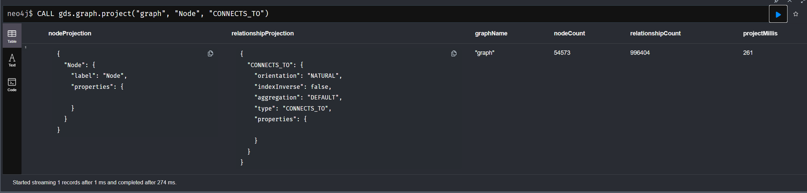

# NEO4j
Paweł Perek, Magdalena Pieron

## Konfiguracja środowiska

### Neo4j
1. Instalacja serwera neo4j zgodnie z instrukcjami na stronie (https://neo4j.com/docs/operations-manual/current/installation/)
2. Uruchomienie serwera neo4j (_bin/neo4j console_)
3. Zmiana domyślnego hasła

### Biblioteka GDS (Graph Data Science)  

1. Instalacja biblioteki zgodnie z instrukcją na stronie https://neo4j.com/docs/graph-data-science/current/installation/
2. Dodanie do pliku konfiguracyjnego (_conf/neo4j.conf_) następujących wpisów:
    - `dbms.security.procedures.unrestricted=gds.*`
    - `dbms.security.procedures.allowlist=gds.*`

Po takiej konfiguracji, powinniśmy móc się zalogować do Neo4j browser przez http://localhost:7474/browser/ na komputerze hosta

### Przygotowanie danych testowych

W treści zadania mieliśmy wybrać jeden z przykładowych zbiorów danych znajdujących się na stronie http://snap.stanford.edu/data/index.html. My wybraliśmy bazę danych Deezera (http://snap.stanford.edu/data/gemsec-Deezer.html), ale algorytmy grafowe opisane poniżej zadziałają na każdym zbiorze danych wylistowanym na tej stronie o ile zostaną prawidłowo zaimportowane. 

Zbiór danych znajduje się w pliku _data/HR_edges.csv_, należy go przenieść do folderu _neo4j/import/_, ponieważ domyślnie neo4j szuka danych właśnie tam, ale można też zmienić folder zbiorów danych w pliku konfiguracyjnym.

Pierwszym krokiem jest utworzenie indeksu w strukturze Node. Nie jest to koniecznie ale znacznie przyśpiesza ładowanie zbioru do bazy danych (na komputerze z i7 4770k, 24GB RAM ładowanie przyśpieszyło z 6 godzin do 4 sekund). Zapytanie wygląda następująco:

```
CREATE INDEX FOR (n: Node) ON (n.id)
```

Zapytanie importu danych w języku Cypher:

```
:auto LOAD CSV WITH HEADERS FROM 'file:///HR_edges.csv' AS line
CALL {
    WITH line
    MERGE (n:Node {id: toInteger(line.node_1)})
    MERGE (m:Node {id: toInteger(line.node_2)})
    MERGE (n)-[:CONNECTS_TO]-(m)
} IN TRANSACTIONS
```

W teorii można to zapytanie wykonać bez dzielenia na transakcje, ale metoda ta nie jest polecana dla zbiorów danych z dużą ilością relacji, bo algorythm musi trzymać dużą ilość informacji w pamięci. Zapytanie bez transakcji wyglądałoby następująco:

```
LOAD CSV WITH HEADERS FROM 'file:///HR_edges.csv' AS line
MERGE (n:Node {id: toInteger(line.node_1)})
MERGE (m:Node {id: toInteger(line.node_2)})
MERGE (n)-[:CONNECTS_TO]-(m)
```

Silnik neo4j sam ustala wielkość transakcji dzięki klauzuli _:auto_, na w.w. komputerze jest to 1000 relacji na transakcję.

Jeśli ładowanie się powiodło to powinniśmy mieć możliwość wybrania wierzchołków i relacji następującym zapytaniem:
```
MATCH (n) - [r] - (m) RETURN * LIMIT 100
```

Przykładowy graf:


## Algorytmy grafowe

Biblioteka GDS która implementuje algorytmy grafowe nie działa bezpośrednio na grafach znajdujących się w pamięci neo4j. Zamiast tego należy wykonać funkcję `gds.graph.project(nazwa_grafu, nazwa_wierzchołków, nazwa_relacji)`. Funkcja ta zapisze graf znajdujący się w bazie danych do specjalnej reprezentacji na której będzie operować. 
**Uwaga:** Specjalna reprezentacja używana przez GDS nie jest persystowana pomiędzy uruchomieniami bazy danych, więc trzeba ją tworzyć od nowa przy każdym resecie bazy danych.

W naszym wypadku nazwa wierzchołków to `Node`, a relacji to `CONNECTS_TO`, więc zapytanie będzie wyglądać tak:
```
CALL gds.graph.project("graph", "Node", "CONNECTS_TO")
```
Wynik:


Wizualizacja 500 pierwszysch relacji w bazie:


### Najkrótsza ścieżka

Do obliczenia najkrótszej ścieżki między węzłami skorzystaliśmy z algorytmu Djikstry:
```
MATCH (source: Node{id: początkowe_id}), (target: Node{id: końcowe_id})
CALL gds.shortestPath.dijkstra.stream("graph", {
    sourceNode: source,
    targetNode: target
})
YIELD nodeIds
RETURN nodeIds
```

Przykładowy wynik:


Wizualizacja:


### PageRank
```
CALL gds.pageRank.stream("graph")
YIELD nodeId, score
MATCH (n) WHERE id(n) = nodeId
RETURN n, score
ORDER BY score DESC
LIMIT 100
```

Przykładowy wynik:


Wizualizacja:


### Silnie spójne składowe

Nasz graf jest grafem nieskierowanym, więc algorytm obliczył tylko jedną silnie spójną składową z ID 0:
```
CALL gds.alpha.scc.stream("graph")
YIELD nodeId, componentId
RETURN nodeId, componentId
ORDER BY componentId
```

Wynik:


### Centralność

Jest to jedyna data którą musieliśmy ograniczyć przez złożoność obliczeniową:
```
CALL gds.betweenness.stream("graph", { 
    samplingSize: 100 
})
YIELD nodeId, score
RETURN nodeId AS node, score
ORDER BY score DESC
LIMIT 100
```

Wynik:

